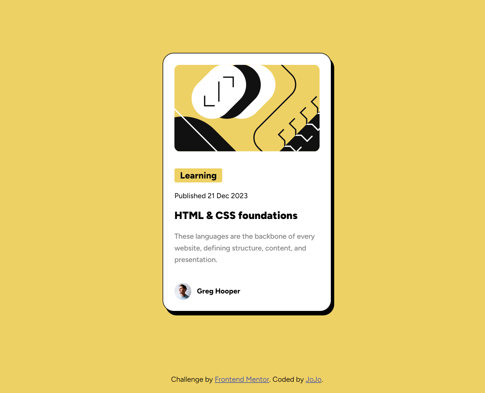

# Frontend Mentor - Blog preview card solution

This is a solution to the [Blog preview card challenge on Frontend Mentor](https://www.frontendmentor.io/challenges/blog-preview-card-ckPaj01IcS). Frontend Mentor challenges help you improve your coding skills by building realistic projects.

## Table of contents

- [Frontend Mentor - Blog preview card solution](#frontend-mentor---blog-preview-card-solution)
  - [Table of contents](#table-of-contents)
  - [Overview](#overview)
    - [The challenge](#the-challenge)
    - [Screenshot](#screenshot)
    - [Links](#links)
    - [Built with](#built-with)
    - [What I learned](#what-i-learned)
    - [Continued development](#continued-development)
    - [Useful resources](#useful-resources)

## Overview

### The challenge

Users should be able to:

- See hover and focus states for all interactive elements on the page

### Screenshot



### Links

- Solution URL: [Add solution URL here](https://your-solution-url.com)
- Live Site URL: [Add live site URL here](https://your-live-site-url.com)

### Built with

- Vanilla CSS and HTML5

### What I learned

1. How to import font from local files and use variable fonts.

   1. Import font from local files can be done by using `@font-face` property of CSS and refers to path of the font file.
   2. Variable fonts can be directly used by importing font from local files and it replaces the need to import multiple font files for each font weight.

   ```css
   @font-face {
     font-family: "Font Name";
     font-style: normal; /* italics */
     font-weight: 400; /* normal font weight */
     font-weight: 100 900; /* variable font weight */
     src: url("path/to/font/file");
   }
   ```

2. How to use object-fit property. There are several object-fit properties, but just adding one of them, cover, can maintain the aspect ratio of the image and fill the entire container.

3. Hover parent change child.

   ```css
   .parent:hover .child {
     /* change child when parent is hovered */
   }
   ```

4. There should be exactly one h1 element in a page and h1 refers to the most important to h6 as the least important.

5. All content in the page(all texts) should be contained within landmarks including header, main, footer, nav, etc.

### Continued development

I want to enhance responsiveness of this site by changing font size or the width of the card.

### Useful resources

- [Image object-fit property](https://www.w3schools.com/css/css3_object-fit.asp) - This taught me what are differences between each object-fit property.
- [Import Font](https://www.digitalocean.com/community/tutorials/how-to-load-and-use-custom-fonts-with-css) - This taught me how to import font from local files and use variable fonts.
- [CSS Dropshadow generator](https://webcode.tools/css-generator/drop-shadow) - This helped me to generate dropshadow for the card.
- [CSS hover parent change child](https://stackoverflow.com/questions/5061940/changing-the-child-elements-css-when-the-parent-is-hovered) - This helped me to change the child element when the parent is hovered.
